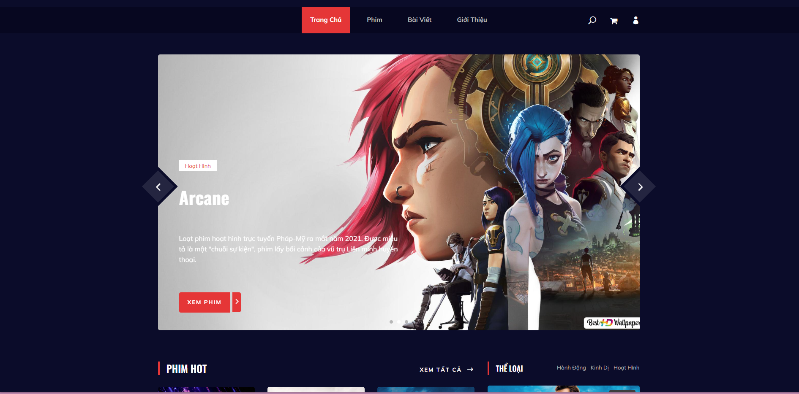
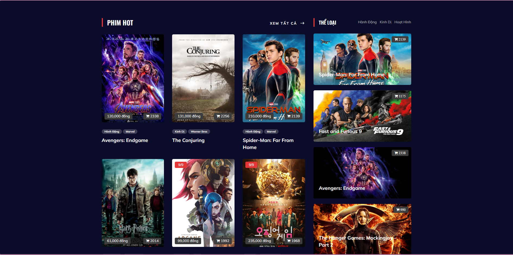
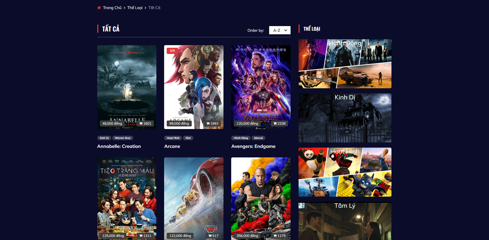
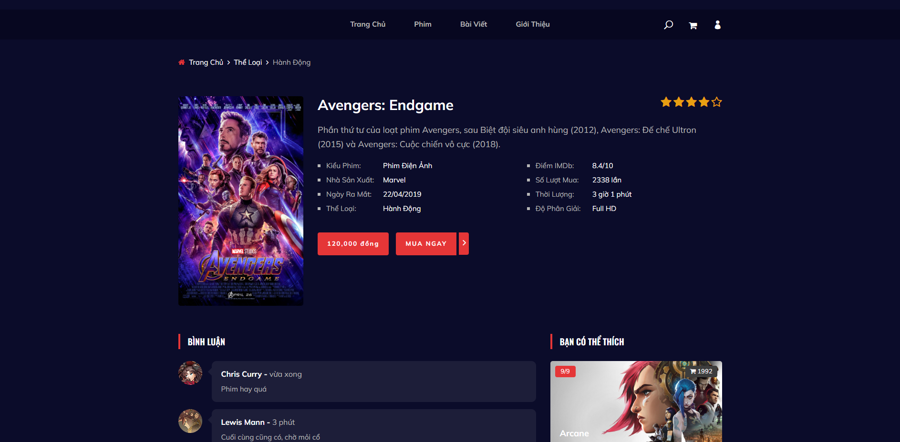
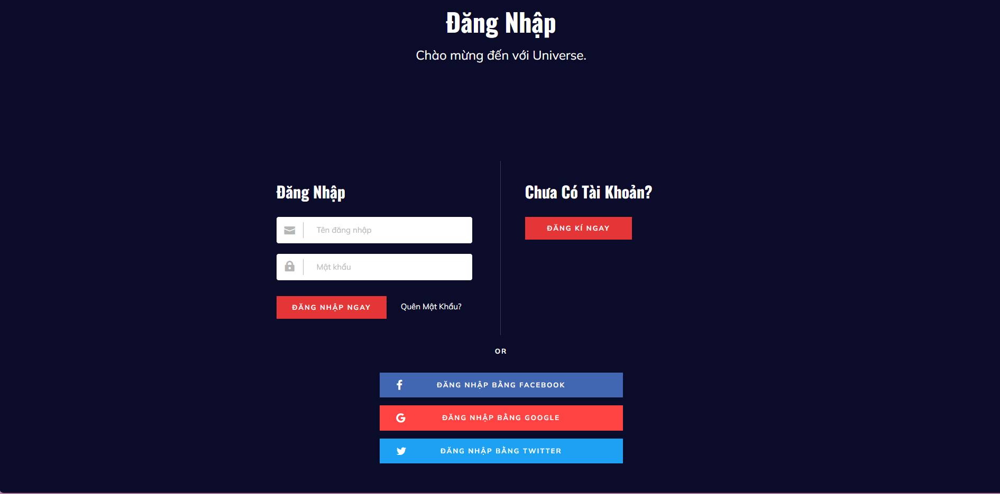
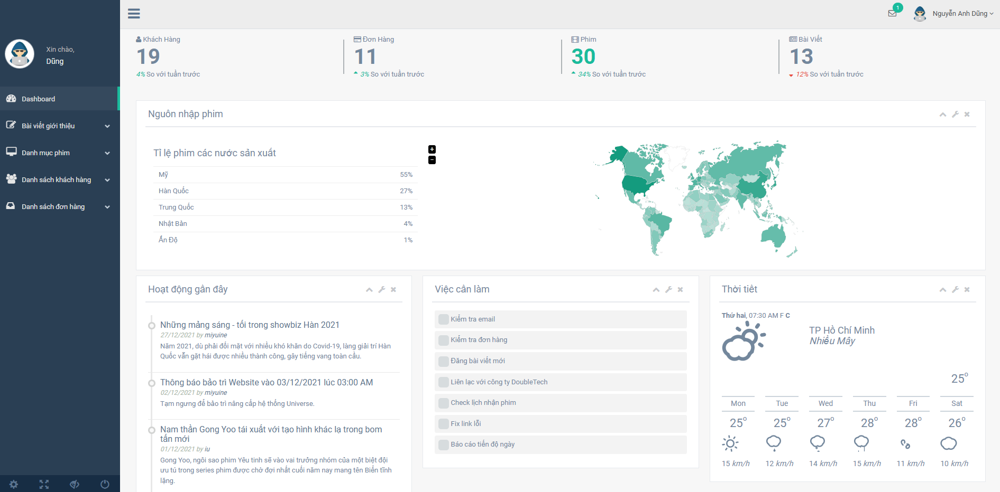

# UNIVERSE - Movie E-Commerce ASP.NET MVC Web Application

Welcome to my Movie E-Commerce ASP.NET MVC Web Application project! This web application is designed to provide movie enthusiasts with a seamless and user-friendly platform to explore, purchase, and enjoy their favorite films online.

## Table of Contents
- [Project Overview](#project-overview)
- [Key Features](#key-features)
- [Built With](#built-with)
- [Project Screenshots](#project-screenshots)

## Project Overview

In the digital age of entertainment, the way we discover, purchase, and enjoy movies has evolved. Our project aims to revolutionize the movie e-commerce experience by offering the following key features:

## Key Features

- **User Registration and Authentication**: Create an account, sign in securely, and manage your profile for a personalized and secure experience.

- **Browsing**: Explore a vast catalog of movies categorized by genre, release date, and popularity and more.

- **Movie Details**: Dive into detailed movie pages featuring synopses, cast , release day, and user reviews to aid in informed decision-making.

- **Shopping Cart**: Add and remove items, view order summaries, and proceed to a checkout process.

- **Admin Panel**: Manage movies, user accounts, orders, and reviews efficiently with the administrative dashboard.

## Built With

* [![HTML][HTML.com]][HTML-url]
* [![CSS][CSS.com]][CSS-url]
* [![JS][JS.com]][JS-url]
* [![Bootstrap][Bootstrap.com]][Bootstrap-url]
* [![JQuery][JQuery.com]][JQuery-url]
* [![NET][NET.com]][NET-url]
* [![CS][CS.com]][CS-url]

<!-- MARKDOWN LINKS & IMAGES -->
<!-- https://www.markdownguide.org/basic-syntax/#reference-style-links -->

[CS-url]: https://www.w3schools.com/cs
[CS.com]: https://img.shields.io/badge/C%23-239120?style=for-the-badge&logo=c-sharp&logoColor=white
[JS-url]: https://www.javascript.com/
[JS.com]: https://img.shields.io/badge/JavaScript-F7DF1E?style=for-the-badge&logo=javascript&logoColor=black
[NET-url]: https://dotnet.microsoft.com/en-us/
[NET.com]: https://img.shields.io/badge/.NET-5C2D91?style=for-the-badge&logo=.net&logoColor=white
[CSS-url]: https://www.w3schools.com/css/
[CSS.com]: https://img.shields.io/badge/CSS3-1572B6?style=for-the-badge&logo=css3&logoColor=white
[HTML-url]: https://www.w3schools.com/html/
[HTML.com]: https://img.shields.io/badge/HTML5-E34F26?style=for-the-badge&logo=html5&logoColor=white
[Bootstrap.com]: https://img.shields.io/badge/Bootstrap-563D7C?style=for-the-badge&logo=bootstrap&logoColor=white
[Bootstrap-url]: https://getbootstrap.com
[JQuery.com]: https://img.shields.io/badge/jQuery-0769AD?style=for-the-badge&logo=jquery&logoColor=white
[JQuery-url]: https://jquery.com 

## Project Screenshots

